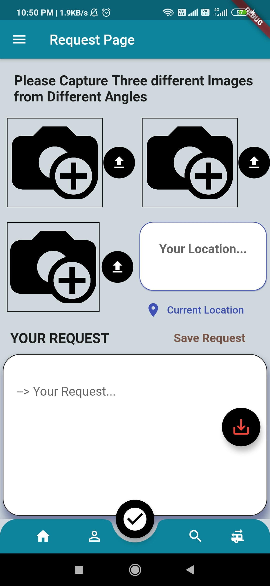
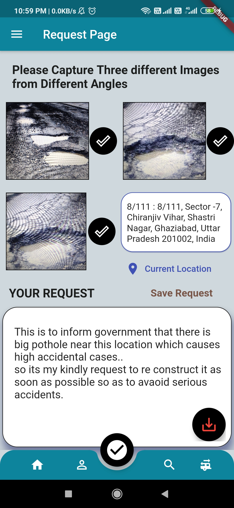
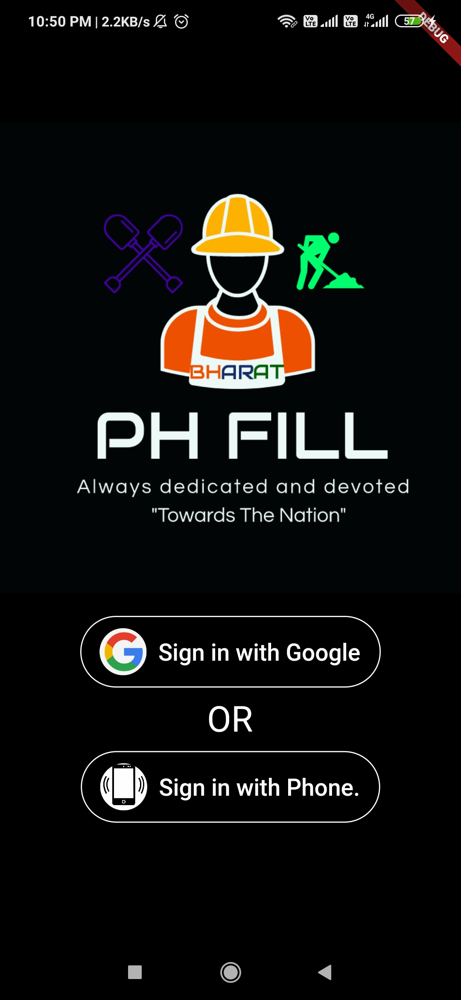
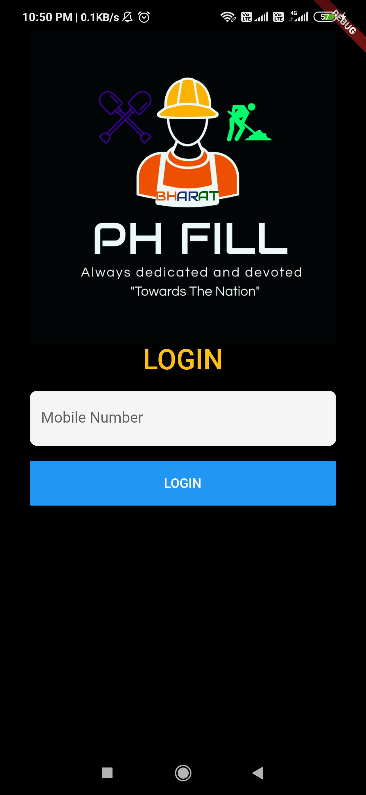
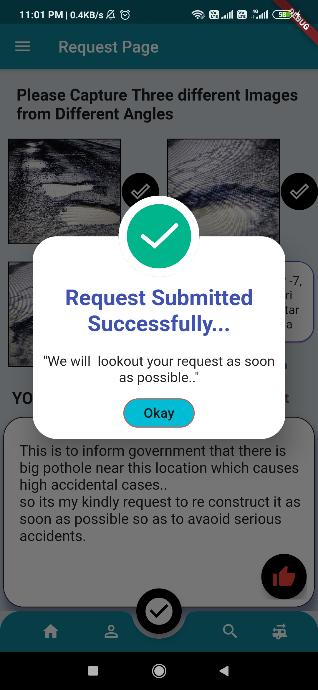
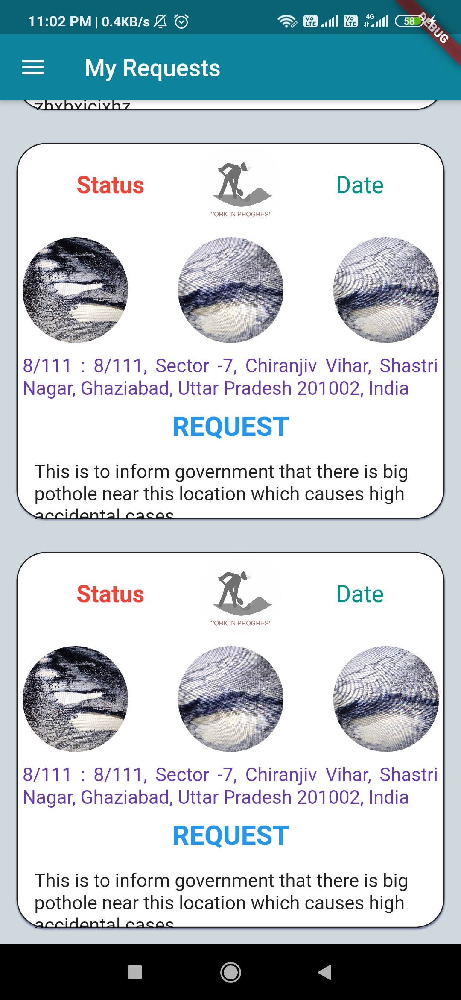

# PH Fill

The basic idea behind the app is to inform the government about the required construction of Potholes located at any place so as to avoid serious accidents.

And its Computer vision based algorithm detects the overall damage percentage of Pothole and give sufficient information in government database about the neccessity of required construction in that particular pothole.
Scroll for more images!.

   &nbsp; &nbsp; &nbsp;   

# Used Technology and equipments:

1. Flutter ( for design ,frontend+backend).
2. Computer vision based algorithm (Which will detects the overall damage in picture   captured by user).
3. Camera Integration (To capture images).
4. Location Integration ( which will take user current location).

# How it will work:

1. User will login through Gmail/Phone authentication.

   &nbsp; &nbsp; &nbsp;   

2. Main screen will appear , here it will capture 3 images from different angle.

3. click on Location button, so as to reach current location.
4. Fill the response in The response Box.

5. Save all details and click on submit button. Thats all.

It will send all data to database successfully. The Government body incharge can get access to all images(evaluated with Computer vision) with exact location. 

6. User can check progress status in MY REQUEST SECTION.

# How DataBase will work:

The database will receive all the filled details by users in the main app and will store it in the following manners:

1. User Authentication .

2. User Personel Details .

3. User Response.

4. User Picked Images.

